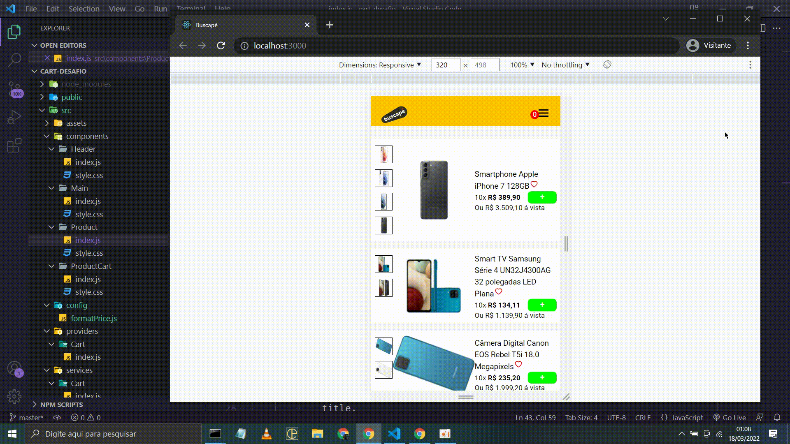

# 💻 | SOBRE APLIACAÇÃO
Sistema de carrinho usando o ui clone do buscapé, fazendo requisição api aplicação retornas os produtos disponivel para compra

# 🚀 | TECNOLOGIAS
1. REACTJS
1. HTML
1. JSX
1. CSS3
1. AXIOS
1. CONTEXT API

# :cowboy_hat_face: | MODO DE USAR
```sh
yarn
yarn start
json-server data.json --port 3500
```

# 😱 | RESULTADO


# 📝 | Licença
Esse projeto está sob a licença MIT. Veja o arquivo [LICENSE](README.md) para mais detalhes.